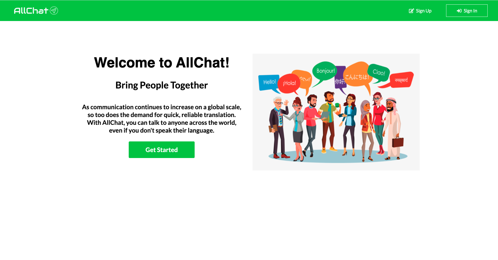

<h1 align="center">
  <br>
  <a href="https://all-chat-v2.herokuapp.com/"></a>
  <br>
  Messaging Application
  <br>
</h1>


<div align="center">
<h4>As communication continues to increase on a global scale, so too does the demand for quick, reliable translation. With AllChat, you can talk to anyone across the world, even if you don't speak their language. With AllChat, there are no language barriers! You can begin chatting here: <a href="https://all-chat-v2.herokuapp.com/" target="_blank">AllChat</a></h4>
</div>

<p align="center">
  <a href="https://github.com/feross/standard">
    
  </a>
</p>

<p align="center">
  <a href="#features">Features</a> •
  <a href="#technologies-used">Technologies Used</a> •
  <a href="#apis-used">APIs Used</a> •
  <a href="#contribute">Contribute</a> •
  <a href="#credits">Credits</a> •
  <a href="#mvp">MVP</a> 
</p>




## Features
* Translate Messages
    - It does not matter what language other users speak. Every message has the option to be translated to your preferred language that you chose upon signing up. 
    - Click on "See Translation" to view a message translated in your preferred language,and if you want to see the original, click "See Original".


*  User Authentication
    - Using Passport.js' jwt stratgey, user login information is authenticated, and so is every request made by that user
```javascript
    // Create JWT Strategy for handling JWT
    // This strategy is for authenticating users on each request
    const jwtLogin = new JwtStrategy(jwtOptions, async (payload, done) => {
        // See if the user ID in the payload exists in our database
        //  If it does, call 'done' with that user
        //  otherwise, call done without a user object
        try {
        const user = await User.findById(payload.sub).select('-password');
        if (!user) {
            return done(null, false);
        }
        return done(null, user);
        } catch (e) {
            return done(e, false);
        }
    });
```

* Rooms and Message Delete
    - Not only are rooms and messages created with Socket in real time, but they can also be deleted. However, only the user who created the room/message can delete that room/message.


## Technologies Used
- [React](https://reactjs.org/)
- [Redux](https://redux.js.org/)
- [Socket.IO](https://socket.io/)
- [Passport.js](http://www.passportjs.org/)
- [MongoDB](https://www.mongodb.com/)
- [Express.js](https://expressjs.com)
- [Node.js](https://nodejs.org/en/)

### APIs Used

- All messages translated with [Google Cloud Translate](https://cloud.google.com/translate/docs/quickstarts)

```javascript
  translateMessage: async (req, res) => {
      //grab the message object and the user's preferred language
        const {message, language} = req.body;
        try {
            //make the API request to translate the message
            const apiRes = await axios.get(
                `https://translation.googleapis.com/language/translate/v2?target=${language}&q=${encodeURIComponent(message.text)}&key=${process.env.REACT_APP_API_KEY}`
                );
            //set the translated text to translation variable
            const translation = apiRes.data.data.translations[0].translatedText;
            const newMessage = message;
            //set the text key in message to the translated message
            newMessage.text = translation;
            //set the origin language that was auto detected 
            newMessage.originLanguage = apiRes.data.data.translations[0].detectedSourceLanguage;
            console.log(newMessage)  
            return res.json({newMessage})
        } catch (error) {
            throw error;
        }
    },
```

## Contribute

If you wish to contribute, send a code snippet of a component, style, or anything else that can improve our app to one of our e-mail addresses:

- paul.myung.han@gmail.com
- suneetha@gmail.com
- jpgeib2@gmail.com

You can also contact us through our built in Contact Page, located in the footer.

## Credits

- Paul Han: 
    - Front-end Development
    - Back-end Server 
    - Socket
    - MongoDB and Mongoose Schemas
    - GitHub: https://github.com/paulmhan
- Suneetha Burla: 
    - Front-end Development
    - Back-end Server
    - Socket
    - MongoDB and Mongoose Schemas
    - GitHub: https://github.com/suneethaburla
- James Geib: 
    - Front-end Development
    - Front-end Design
    - GitHub: https://github.com/jpgeib

## MVP 

Where it all began: [AllChat - MVP](https://github.com/paulmhan/AllChat)

