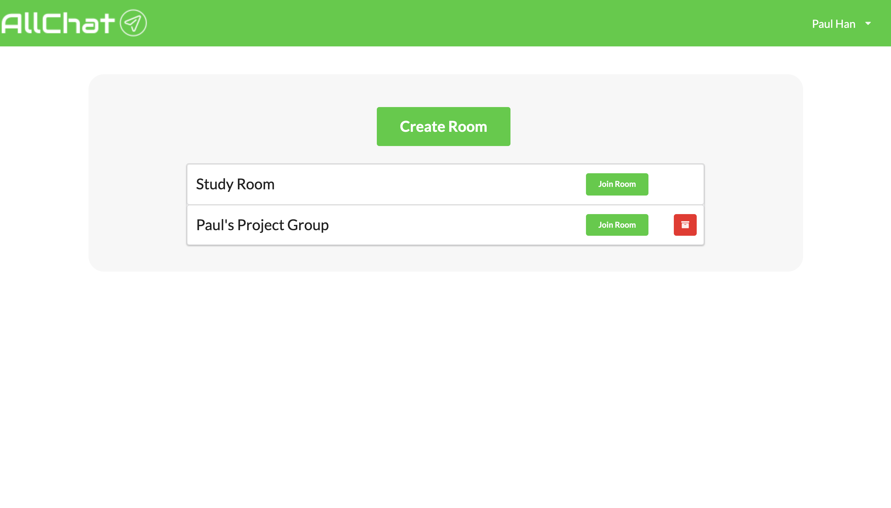
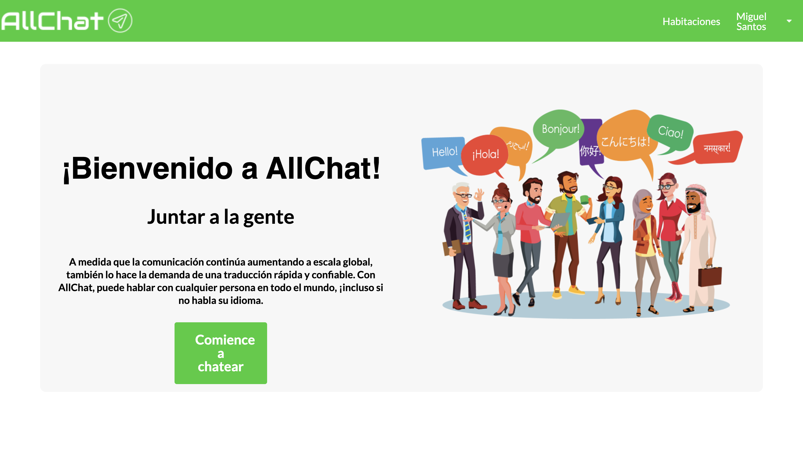

# AllChat Messaging Application


As communication continues to increase on a global scale, so too does the demand for quick, reliable translation. With AllChat, you can talk to anyone across the world, even if you don't speak their language. With AllChat, there are no language barriers! 

You can begin chatting here: [AllChat](https://all-chat-v2.herokuapp.com/)

## Motivation 


## Screenshots




## Features

## Technologies Used

### APIs Used

- Search for books using the [Google Cloud Translate](https://cloud.google.com/translate/docs/quickstarts)

```javascript
  translateMessage: async (req, res) => {
      //grab the message object and the user's preferred language
        const {message, language} = req.body;
        try {
            //make the API request to translate the message
            const apiRes = await axios.get(`https://translation.googleapis.com/language/translate/v2?target=${language}&q=${encodeURIComponent(message.text)}&key=${process.env.REACT_APP_API_KEY}`);
            //set the translated text to translation variable
            const translation = apiRes.data.data.translations[0].translatedText;
            const newMessage = message;
            //set the text key in message to the translated message
            newMessage.text = translation;
            //set the origin language that was auto detected 
            newMessage.originLanguage = apiRes.data.data.translations[0].detectedSourceLanguage;
            console.log(newMessage)  
            return res.json({newMessage})
        } catch (error) {
            throw error;
        }
    },
```


## How To Use?

On the landing page, click "Get Started" and enter a username into the modal, then click "Join Chat Room". Once on the chat page, you can message other users who are currently signed in. If you wish to exit the chat, and sign up using a different name, click the "Leave" button in the top-right corner, and repeat the aforementioned steps.

## Code Style

[](https://github.com/feross/standard)

## Contribute

If you wish to contribute, send a code snippet of a component, style, or anything else that can improve our app to one of our e-mail addresses:

- paul.myung.han@gmail.com
- suneetha@gmail.com
- jpgeib2@gmail.com

## Credits

- Paul Han: 
    - Front-end Development
    - Back-end Server 
    - Socket.IO
    - MongoDB and Mongoose Schemas
    - GitHub: https://github.com/paulmhan
- Suneetha Burla: 
    - Front-end Development
    - Back-end Server
    - Socket.IO 
    - MongoDB and Mongoose Schemas
    - GitHub: https://github.com/suneethaburla
- James Geib: 
    - Front-end Development
    - Front-end Design
    - GitHub: https://github.com/jpgeib

## MVP 

Where it all began; our MVP version of AllChat: [AllChat - MVP](https://github.com/paulmhan/AllChat)

